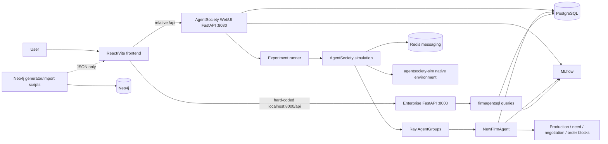
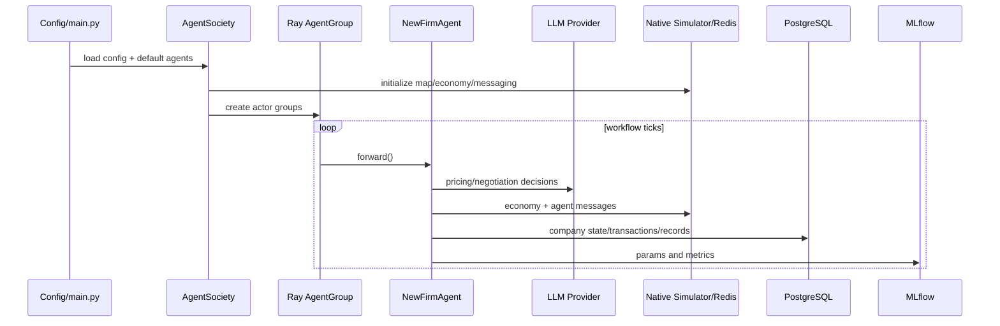
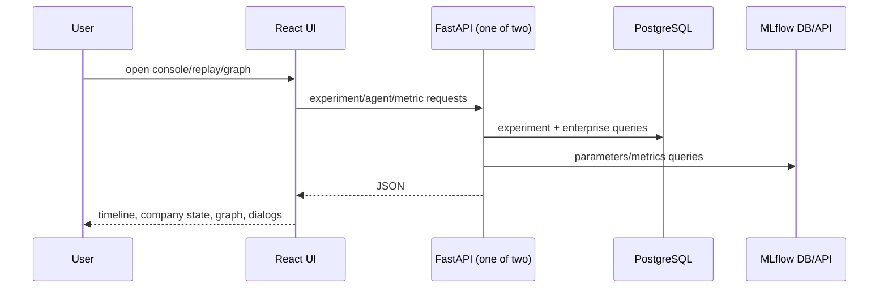
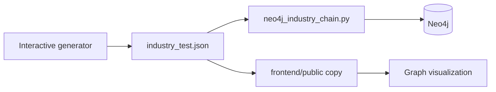

# Baseline Architecture

## Executive view

The repository is not one cohesive application. It is a forked AgentSociety runtime plus a supply-chain-specific enterprise layer, a second read API, standalone graph scripts, analytics scripts, and a React UI. Two backend APIs overlap, while Neo4j is offline and disconnected from the request path.

## Module responsibilities

### `agentsociety`

- `configs`: Pydantic configuration for environment, agents, workflows, LLMs and storage.
- `simulation`: orchestration, workflow execution, Ray actor groups, persistence and metrics.
- `environment`: clients for the native city/economy simulator and map data.
- `agent`: base Agent/Block abstractions, triggers, prompt rendering and memory configuration generation.
- `memory`: profile/status/stream memory and FAISS-backed retrieval abstraction.
- `llm`: multi-provider OpenAI-compatible LLM client plus local/simple embeddings.
- `message`: Redis-backed agent messaging and optional interception.
- `storage`: async PostgreSQL writer and Avro output.
- `metrics`: MLflow wrapper.
- `webapi`: first FastAPI application for experiments, agents and surveys, with SQLAlchemy models.
- `cityagent`: default citizen, firm, government, bank and NBS agents. The fork maps a `firm` config to `NewFirmAgent`.

### `SupplyChainAgent/enterprise`

- `main.py`: starts Ray, loads the local config, fills default Agent classes, initializes and runs `AgentSociety`.
- `enterprise_Api.py`: second FastAPI app with enterprise-specific read endpoints backed by `firmagentsql` and MLflow tables.
- `Api.py`: small file-based `/api/state/{fid}` API; it is not the README's primary API.
- `config.yaml`: enterprise simulation configuration with LLM, PostgreSQL, Redis, MLflow and map settings.

### `firmagentsql`

- `insert.py`: creates and writes `company_states`, `transaction_list`, and `company_records`.
- `select.py`: low-level enterprise queries and exports.
- `latest_experiment_query.py`: joins legacy AgentSociety/MLflow database tables by convention.
- analysis scripts: large, tightly coupled reporting and clustering programs rather than an application repository layer.

### `neo4j`

- Generates synthetic companies, products, recipes and supply relationships into JSON.
- Imports that JSON into Neo4j using hard-coded connection values.
- Builds `Company` nodes with embedded product data and supply relationships.
- Is not part of Docker Compose, FastAPI dependency injection, or the online frontend API. The frontend mostly reads checked-in JSON copies.

### `frontend`

- React 18, TypeScript, Vite, Ant Design, MobX, G6, Deck.gl and Mapbox.
- Routes include home, experiment console/replay, survey/configuration pages and an industry graph.
- Uses both relative `/api` calls (expected to be proxied) and a separate hard-coded `http://localhost:8000/api` client.
- Can also load local `state_*.json` and `public/neo4j/industry_test.json` data.

### `docker`

- Compose provides PostgreSQL, Redis and MLflow only.
- Neo4j is absent.
- Passwords are static `CHANGE_ME` placeholders.
- MLflow is built locally in the non-China compose file and referenced as a prebuilt local image in the China file.

## Agent architecture

`AgentSociety` creates a native environment, Redis messaging, optional MLflow/Avro, PostgreSQL writer actors and Ray `AgentGroup` actors. Default configuration replaces the generic firm with `NewFirmAgent` and adds initialization functions.

`NewFirmAgent.forward()` performs this actual sequence:

1. lazily connects directly to PostgreSQL and determines the latest experiment;
2. publishes product information into the simulated global economy state;
3. periodically asks the LLM for sell-price decisions;
4. runs stock/production behavior;
5. computes material need;
6. processes collaboration/inquiry/negotiation/order behavior;
7. executes economy/payment/order updates;
8. records static parameters and step metrics in MLflow;
9. persists enterprise state, transactions and communication records to PostgreSQL.

This is not a planner-supervisor multi-agent workflow. It is a time-stepped actor simulation whose blocks mix reasoning, side effects, storage and orchestration.

## Persistence models

### AgentSociety SQLAlchemy models

- experiments and experiment status/time;
- agent profiles, status, dialogs and surveys;
- global prompts and associated metadata.

### Enterprise direct SQL tables

- `company_states`: experiment, step, company, level, intelligence level and JSONB inventory;
- `transaction_list`: purchaser/supplier/product/payment fields tied to state;
- `company_records`: communication/operation events and raw JSON.

The two layers share a PostgreSQL database but do not share one consistent repository/unit-of-work abstraction. Enterprise code also queries MLflow's internal database tables directly, coupling it to MLflow schema details.

## Current data flows

### Simulation write path

### User read path

### Neo4j path

There is no confirmed runtime path `User -> API -> Neo4j -> response`.

## Configuration and logging

- Configuration uses YAML plus Pydantic, but checked-in files contain provider URLs, placeholder keys and passwords.
- Several modules use direct `print`, including verbose state and transaction debug output.
- The shared logger exists but is not consistently used.
- Paths, API base URLs, Neo4j credentials and database assumptions are spread across code and YAML.
- There is no secrets validation or fail-fast environment profile.

## State management

- Backend simulation state exists in native simulator services, agent memory, Redis, Ray actors, PostgreSQL and MLflow.
- Frontend replay state is a large MobX store that merges API responses, local files and graph JSON.
- The same concepts are represented with inconsistent field names (`cur_day`/`curDay`, string/numeric IDs, `products`/`company_products`), causing current TypeScript build failures.

## Testing reality

No automated tests were found. The repository has no verified contract tests across the two APIs, no domain tests for production/negotiation/order logic, no integration tests for databases, and no deterministic LLM test double.

## Architectural diagnosis

The strongest reusable assets are the FastAPI/Pydantic patterns, asynchronous PostgreSQL knowledge, React visualization ideas, graph-generation concepts, and LLM/provider wrappers. The legacy simulation runtime is too coupled to Ray, city simulation binaries, maps, Redis, MLflow and direct DB writes to serve as the core of an enterprise quality platform.
