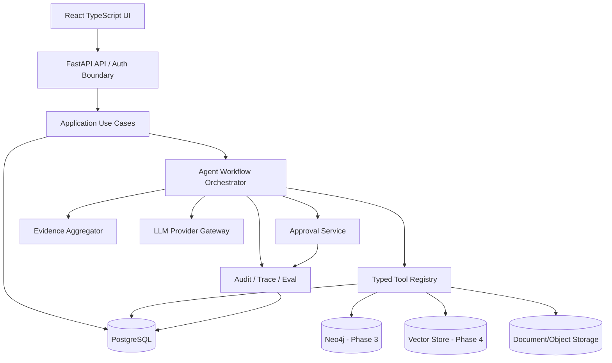
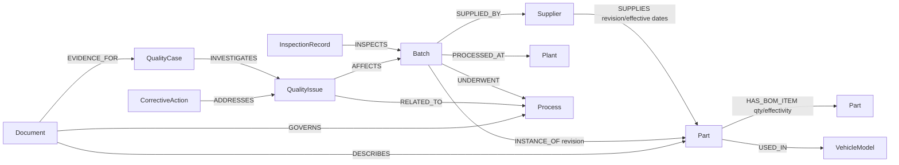
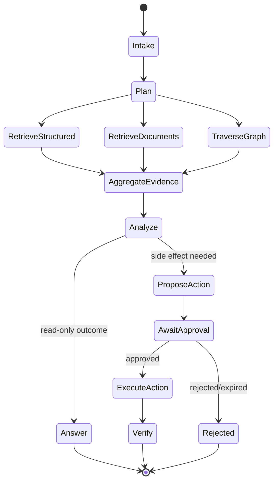

# FactoryOps AI Target Architecture

## Recommendation

Build an evolutionary modular monolith first:

- React + TypeScript frontend;
- one Python/FastAPI application containing domain, use-case, tool and workflow modules;
- PostgreSQL as the system of record;
- Neo4j added in Phase 3 for graph traversal;
- object/file storage for documents, with vector retrieval added only after document ingestion is proven;
- an explicit workflow state machine initially, with LangGraph considered in Phase 5;
- an outbox and background worker before RabbitMQ;
- no Spring Boot, Redis, RabbitMQ or Qdrant in Phase 1.

This reduces distributed-system overhead while preserving clean boundaries that can later be extracted.



## Service architecture

Start as deployable modules in one service:

- `identity`: users, roles and plant/supplier scope;
- `master_data`: suppliers, parts, BOMs, plants, processes and vehicle models;
- `quality`: inspections, issues, cases and corrective actions;
- `documents`: metadata, ingestion status and document access;
- `graph`: projection and impact queries;
- `agent`: sessions, workflow state, tool calls, evidence and answers;
- `approval`: proposals, decisions and side-effect execution;
- `audit`: immutable events, traces and evaluation runs.

Module boundaries should prevent direct cross-module table access through application code. Extract a Java/Spring business service only if organizational ownership, throughput, an existing Java ecosystem, or independent deployment becomes a demonstrated requirement.

## Domain and data architecture

### System-of-record entities

- `Supplier`: identity, status, risk tier, sites and qualification.
- `Part`: part number, revision, lifecycle, criticality and supplier links.
- `BOM` + `BOMItem`: versioned parent/child quantities and effective dates.
- `VehicleModel`: model/program and effective BOM variants.
- `Batch`: lot, part revision, supplier, plant, manufacture/receipt dates and disposition.
- `Plant`: organization/site identity and access scope.
- `Process`: versioned production process, station and parameters.
- `InspectionRecord`: batch, characteristic, measured value, limits, result and evidence source.
- `QualityIssue`: issue type, severity, detection context, affected scope and state.
- `QualityCase`: investigation container linking issues, evidence, hypotheses and decisions.
- `CorrectiveAction`: owner, due date, status, verification and linkage to issue/cause.
- `Document`: type, version, source, checksum, access scope and ingestion state.
- `User`, `Role`, `ApprovalDecision`, `AuditEvent`.

Do not overload `QualityIssue` with investigation workflow, or `CorrectiveAction` with approvals. Version BOM, Part, Process and Document references so evidence remains reproducible.

### Knowledge graph

Recommended graph projection:



PostgreSQL remains authoritative. Neo4j is a projection updated through idempotent sync/outbox jobs. Graph nodes store stable IDs and traversal fields, not uncontrolled copies of all business data.

## Agent architecture

Five autonomous agents are not justified initially. Use one orchestrated workflow with specialist tools/nodes:



- Supervisor/planning: deterministic routing plus model-assisted planning under a bounded schema.
- Quality, supply and knowledge capabilities: tools or workflow nodes, not independent agents.
- Evidence aggregation: deterministic normalization, deduplication and provenance.
- Action Agent: a constrained executor that receives only an approved immutable proposal.

Introduce separate agents only when they require independent memory, policies, tools and evaluation ownership.

## Context engineering

Every evidence item should use a common envelope:

```text
evidence_id, source_type, source_id, source_version,
retrieval_query, excerpt_or_fact, permissions_scope,
retrieved_at, confidence, correlation_id
```

Retrieval flow:

1. classify intent and required evidence types;
2. generate typed SQL filters, document query and graph traversal plan;
3. execute read-only tools with tenant/site authorization;
4. normalize and rank evidence;
5. require claims to cite evidence IDs;
6. run a contradiction/missing-evidence check;
7. return answer, uncertainty and recommended next step.

SQL answers facts, vector search finds relevant passages, and graph traversal finds relationships/impact. Do not ask the LLM to synthesize entity IDs or execute raw unrestricted SQL/Cypher.

## HITL and tool policy

| Class | Examples | Default policy |
|---|---|---|
| READ_ONLY | `get_supplier`, `get_batch`, `search_quality_cases`, `graph_impact_analysis`, `search_documents` | Auto-run within authorization and query limits |
| SIDE_EFFECT | `create_corrective_action`, `update_quality_case`, `freeze_batch`, `send_notification` | Create proposal, require explicit approval, execute exactly once |

Approval record:

- proposal ID and immutable arguments hash;
- initiator/user, tenant and scope;
- action name, risk level and human-readable impact;
- evidence IDs and model/workflow version;
- approver, decision, timestamp and optional reason;
- execution idempotency key, result, error and compensation status.

The executor must reject modified/expired proposals and re-check authorization at execution time.

## Trace and observability

- Correlation ID across HTTP request, workflow, tools and DB operations.
- Structured events for plan, retrieval, evidence selection, model call, proposal, approval and action result.
- Redact keys, personal data and protected document content.
- Store prompt/template version, model ID, token usage, latency and tool schema version.
- Add Langfuse or OpenTelemetry only after the internal trace contract is defined; vendor traces are not the audit system of record.

## Evaluation architecture

Benchmark configurations:

1. LLM only;
2. Vector RAG;
3. SQL + Vector;
4. SQL + Vector + Graph.

Metrics:

- task success rate;
- tool-call accuracy and argument validity;
- Evidence Recall@K;
- Related Entity Recall@K;
- hallucinated entity/claim rate;
- citation correctness;
- action-policy violation rate;
- latency, token usage and cost.

Datasets must include expected entities/evidence, allowed tools, forbidden actions and grading rules. Keep eval execution separate from production side effects.

## Technology timing decisions

| Technology | Immediate? | Decision |
|---|---|---|
| Spring Boot | No | Over-design for Phase 1; retain an extraction boundary and revisit when a Java-owned business service is justified |
| LangGraph | No | First implement typed tools and a small explicit state machine; consider in Phase 5 for checkpointing/HITL complexity |
| Redis | No | PostgreSQL is enough for initial state/idempotency; add only for proven cache/lock/session needs |
| RabbitMQ | No | Start with transactional outbox + worker; introduce a broker when independent consumers or throughput require it |
| Qdrant | No | Delay until document corpus, embedding choice and retrieval benchmark exist; start behind a vector interface |
| Neo4j | Phase 3 | Valuable for BOM and impact traversal after authoritative IDs and projection rules exist |
| MySQL | No | Prefer current PostgreSQL to avoid needless migration and retain JSONB/outbox capabilities |
