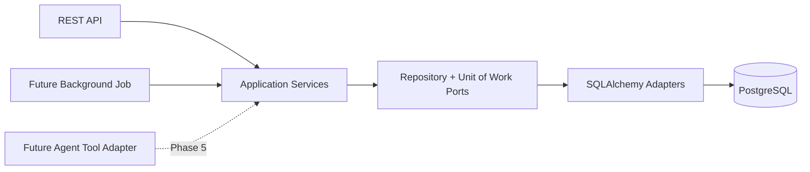

# Agent-ready Service Boundary

## Decision

Phase 1 contains no Agent, LLM, tool registry, prompt, vector search, or autonomous action. It creates a stable business-service boundary that those later capabilities can call without gaining database access.

Dependency direction is `API/Tool -> Application -> Domain/Ports <- Infrastructure`. Application code does not import FastAPI or SQLAlchemy. API routes do not receive a database session and cannot query ORM models.

## Reusable use cases

| Service | Stable calls suitable for later read-only tools |
|---|---|
| `SupplierService` | `list_suppliers`, `get_supplier`, `get_supplier_parts` |
| `PartService` | `list_parts`, `get_part`, `get_part_suppliers`, `get_part_vehicle_models`, `get_part_vehicle_impact` |
| `BatchService` | `get_batch`, `get_batch_context` |
| `InspectionService` | `create_inspection_record`, `list_batch_inspections`, `summarize_batch_inspections` |
| `QualityService` | `create_quality_case`, `get_quality_case`, `list_quality_cases`, `add_issue_to_case`, `create_corrective_action` |

## Future tool adapter pattern

A future `get_batch_context_tool` should validate typed tool input, call `BatchService.get_batch_context(batch_number)`, and translate the transport-neutral result into the tool response. It must not import `Session`, ORM models, SQL, or database credentials.

Stable exceptions (`NOT_FOUND`, `CONFLICT`, `DOMAIN_RULE_VIOLATION`) are shared by REST and future adapters. Side-effecting methods remain ordinary business operations in Phase 1; Phase 6 will add authorization and approval policy outside these services rather than embedding HITL here.

## Boundary tests

Domain tests need no database. Application tests call services through a Unit of Work factory. Repository tests validate SQL adapters separately. API tests exercise serialization and error mapping. This separation allows a future tool adapter to reuse the already-tested application behavior.
