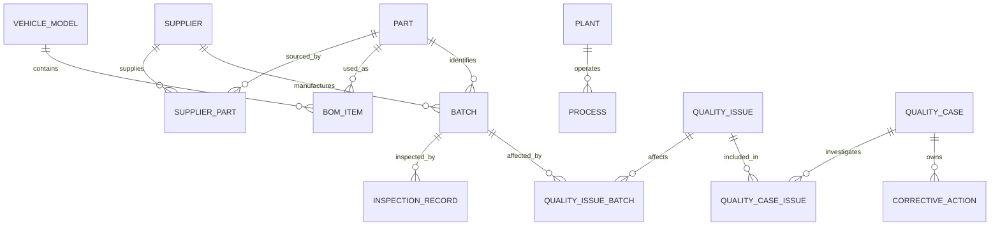

# FactoryOps Phase 1 Domain Model

## Entities and business keys

| Entity | Business key | Important fields and constraints |
|---|---|---|
| Supplier | `supplier_code` | name, category, country, status, risk level |
| Part | `part_number` | name, category, specification, status |
| VehicleModel | `model_code` | fictional name/platform and status |
| BOMItem | vehicle + part + version + effective-from | positive quantity; valid effective range |
| SupplierPart | supplier + part | supplier part number, non-negative lead time; many-to-many sourcing |
| Plant | `plant_code` | name, location, status |
| Process | `process_code` | plant, process type, status |
| Batch | `batch_number` | part, supplier, manufacture/receipt times, positive quantity |
| InspectionRecord | `inspection_number` | batch, optional process, metric, limits, derived PASS/FAIL |
| QualityIssue | `issue_number` | severity, workflow status, detection source/time |
| QualityCase | `case_number` | priority, status, owner, open/close times |
| CorrectiveAction | `action_number` | case, type, status, assignee, due date |
| Document | document number + version | metadata only; type, URI, effective range; no embeddings |
| User | `username` | display name, minimal role and status |

Every entity has a stable UUID string ID, `record_version`, `created_at`, and `updated_at`. PostgreSQL is authoritative. Business keys are independently unique so external systems and future graph projections need not expose internal IDs.

## Relationships

`QualityIssue` and `Batch` are many-to-many, so one systemic issue can affect multiple lots. `QualityCase` and `QualityIssue` are also many-to-many, allowing investigations to group several observations without forcing issue ownership.

## Domain invariants

- Supplier code, part number, vehicle-model code, batch number, inspection number, issue number, case number, corrective-action number, process code, plant code, and username are unique.
- Enumerations constrain inspection result, severity, case status, issue status, action status, lifecycle state, roles, priority, document type, and risk level.
- BOM/document end date cannot precede start date; BOM quantity must be positive.
- Batch quantity must be positive and receipt cannot precede manufacture.
- Inspection lower limit cannot exceed upper limit. Result is derived: an inclusive in-range value is `PASS`; otherwise it is `FAIL`. An inconsistent explicit result is rejected.
- Case close time cannot precede open time.
- Association tables prevent duplicate supplier/part, issue/batch, and case/issue links.

These rules exist in domain constructors and/or database constraints; they are not implemented in API controllers.
