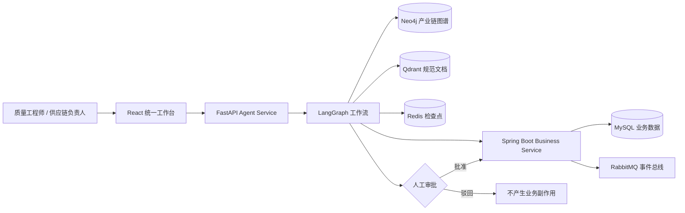

# FactoryOps AI

> 面向制造质量与供应链运营的证据驱动智能体平台

[](https://github.com/Sahotin/AutoSupply-AI/actions/workflows/factoryops-full.yml)
[](https://github.com/Sahotin/AutoSupply-AI/actions/workflows/factoryops-integration.yml)

FactoryOps AI 帮助质量工程师、供应链负责人和工厂管理者处理制造质量异常。系统会从业务数据、产业链图谱和质量规范中检索证据，生成可追溯的影响分析与处置建议，并在执行任何正式业务写入前强制进行人工审批。

当前仓库已经从原始供应链多智能体仿真项目演进为独立的 FactoryOps 制造质量架构；旧版 AgentSociety 仿真代码仍作为兼容与研究路径保留，但不再是 FactoryOps 的默认运行依赖。

## 核心能力

- **质量异常处置**：围绕质量案例、批次、零件和供应商发起智能调查。
- **多源证据检索**：统一展示结构化业务数据、Neo4j 产业链关系和 Qdrant 规范文档证据。
- **产业链影响分析**：追踪异常零件涉及的车型、批次、供应商及上下游依赖。
- **人工审批闭环**：智能体只能提出建议，批准后才允许创建正式纠正措施。
- **可恢复工作流**：LangGraph 工作流检查点存储于 Redis，支持中断后恢复。
- **审计与事件交付**：Spring Boot 负责业务规则、审计记录、事务发件箱和 RabbitMQ 事件发布。
- **仿真与配置**：统一前端保留模型、智能体、工作流和实验管理入口，用于方案验证。
- **真实/离线模式分离**：服务不可用时不会伪造成功；离线体验数据会被清楚标记，并且不会写入业务系统。

## 黄金路径

```text
发现质量异常
    ↓
提交批次影响调查
    ↓
查询业务数据（批次、检验、质量案例）
    ↓
检索产业链图谱（零件、车型、供应商依赖）
    ↓
检索质量规范（SOP、8D、FMEA）
    ↓
生成有证据支撑的处置建议
    ↓
质量负责人批准或驳回
    ↓
批准后创建纠正措施并记录审计事件
```

推荐演示案例为 `CASE-001`：`BATCH-001` 中的 `PART-001` 检验不合格，该零件同时影响 `VM-A` 和 `VM-B` 两个虚构车型平台。

## 统一前端

访问地址：<http://localhost:5173>

| 页面 | 用途 |
|---|---|
| 工作台 | 查看系统定位、模块入口和推荐使用顺序 |
| 质量异常处置 | 运行真实智能体调查，查看证据、建议并完成人工审批 |
| 产业链图谱 | 查看企业、零件、交易、通信和上下游影响关系 |
| 仿真与配置 | 管理大模型、智能体、工作流与仿真实验 |
| 调研问卷 | 管理实验及调查过程中使用的问卷 |

质量异常处置页会主动检查 Agent Service：

- **实时结果**：证据与建议来自实际 Agent API；审批会恢复 LangGraph 工作流，并可能产生正式业务写入。
- **离线体验**：仅在用户主动选择后加载；页面会显示“离线体验数据”，审批不会调用后端，也不会创建纠正措施。

## 快速开始

### 方式一：只体验统一前端

适合先了解页面和业务流程，不需要 Docker。

Windows 可直接双击：

```text
scripts\run-factoryops-demo.cmd
```

或在 PowerShell 中运行：

```powershell
& '.\scripts\run-factoryops-demo.ps1'
```

脚本会安装缺失的前端依赖、启动开发服务器并打开 <http://localhost:5173>。由于完整后端没有启动，“质量异常处置”会明确显示服务未连接；此时可主动加载离线体验数据。

### 方式二：运行完整 FactoryOps 架构

要求：

- Docker Desktop 与可用的 Docker Engine
- Node.js 与 npm
- 建议至少预留 8 GB 内存

先启动完整服务栈：

```powershell
& '.\scripts\run-factoryops.ps1' -NoBrowser
```

再启动统一前端：

```powershell
& '.\scripts\run-factoryops-demo.ps1'
```

也可以直接使用 Compose：

```bash
docker compose -f docker/docker-compose.factoryops.yml up --build --detach
```

完整模式下，统一前端通过本地代理访问 Agent Service。进入“质量异常处置”，点击“运行真实调查”，即可执行 SQL、图谱、文档检索与人工审批工作流。

停止服务：

```bash
docker compose -f docker/docker-compose.factoryops.yml down
```

如需同时删除本地容器数据卷，请在确认不再需要数据后执行：

```bash
docker compose -f docker/docker-compose.factoryops.yml down -v
```

## 服务地址

| 服务 | 地址 | 说明 |
|---|---|---|
| 统一前端 | <http://localhost:5173> | 推荐使用的 FactoryOps 操作界面 |
| Business Service | <http://localhost:8081/api/v1> | Spring Boot 业务 API |
| Business Health | <http://localhost:8081/actuator/health> | 业务服务健康检查 |
| Agent Service | <http://localhost:8082> | FastAPI + LangGraph 智能体服务 |
| Agent Health | <http://localhost:8082/health> | 智能体服务健康检查 |
| RabbitMQ | <http://localhost:15672> | 消息队列管理界面 |
| Neo4j Browser | <http://localhost:7474> | 产业链图数据库界面 |
| Qdrant | <http://localhost:6333> | 向量数据库 API |

## 系统架构



架构原则是将确定性的业务写入与概率性的智能体推理分离：

- Spring Boot 是业务记录与规则的唯一权威来源。
- Agent Service 负责计划、只读检索、证据汇总和建议生成。
- 所有事实结论都应引用 `STRUCTURED`、`GRAPH` 或 `DOCUMENT` 证据。
- 任何纠正措施写入都必须经过人工审批。

## 技术栈

| 层级 | 技术 |
|---|---|
| 前端 | React 18、TypeScript、Vite、Ant Design、AntV G6、Deck.gl |
| 智能体 | Python 3.12、FastAPI、LangGraph、Pydantic |
| 业务服务 | Java 21、Spring Boot、Flyway、Maven |
| 业务数据库 | MySQL 8.4 |
| 工作流状态 | Redis Stack |
| 产业链图谱 | Neo4j 5 |
| 文档检索 | Qdrant、FastEmbed |
| 事件系统 | RabbitMQ 4 |
| 交付与验证 | Docker Compose、GitHub Actions、Pytest |

## 项目目录

```text
SupplyChainAgent/
├─ frontend/                    # 当前统一 React 工作台
├─ services/
│  ├─ business-service/        # Spring Boot 业务核心、审计与事件
│  └─ agent-service/           # FastAPI + LangGraph 智能体工作流
├─ factoryops/                 # Phase 1 Python 领域模型与 API 基础
├─ docker/                     # FactoryOps Compose 编排
├─ scripts/                    # Windows 一键启动与黄金路径脚本
├─ evals/                      # 确定性评估数据集
├─ tests/                      # 领域、应用、仓储与 API 测试
├─ docs/                       # 架构、数据、API、运维与验收文档
├─ agentsociety/               # 保留的上游仿真兼容代码
└─ SupplyChainAgent/            # 保留的旧版实验运行路径
```

## 验证

前端打包：

```bash
cd frontend
npm ci
npm exec vite -- build
```

智能体测试：

```bash
cd services/agent-service
pip install -e ".[test]"
pytest -q
```

业务服务测试：

```bash
cd services/business-service
mvn --batch-mode verify
```

Compose 配置检查：

```bash
docker compose -f docker/docker-compose.factoryops.yml config
```

CI 分为代码级验证和真实基础设施集成验证。完整集成流程会启动 MySQL、Redis、RabbitMQ、Neo4j、Qdrant、Business Service 与 Agent Service，并验证 SQL + 图谱 + 文档证据、人工审批恢复、业务写入和事件幂等性。

## 演示数据说明

仓库内置数据全部为确定性、虚构的制造质量数据，不代表任何真实企业、供应商、车型、零件、批次或质量事故。

当前数据集包括：

- 10 个供应商
- 30 个零件
- 4 个虚构车型
- 36 个批次
- 108 条检验记录
- 16 个质量问题
- 10 个质量案例
- 12 条纠正措施
- 16 条文档元数据

详细说明见 [演示数据文档](docs/09_seed_dataset.md)。

## 进一步阅读

- [完整架构](docs/15_full_architecture.md)
- [智能体工作流](docs/16_agent_workflow.md)
- [数据与事件](docs/17_data_and_events.md)
- [黄金路径演示](docs/18_golden_path_demo.md)
- [评估体系](docs/19_evaluation.md)
- [运维说明](docs/20_operations.md)
- [验收报告](docs/21_acceptance_report.md)
- [API 契约](docs/08_api_contract.md)

## 当前边界

- 实时智能体调查依赖完整基础设施；仅启动前端时只能使用明确标记的离线体验数据。
- 仓库保留部分旧版供应链仿真与回放模块，用于兼容和研究，不属于 FactoryOps 默认黄金路径。
- 真实大模型与可观测平台需要用户自行提供凭据；没有凭据时，测试使用确定性模型替身。
- 正式生产部署仍需补充身份认证、权限模型、企业数据连接器、密钥管理和安全审计策略。

## 开源来源与归属

本项目基于 [HIT-ICES/SupplyChainAgent](https://github.com/HIT-ICES/SupplyChainAgent) 的开源代码演进，并保留相关历史和兼容代码。FactoryOps 新增架构与修改通过 Git 历史进行区分。

详细复用范围与归属说明见 [开源归属文档](docs/06_open_source_attribution.md)。
